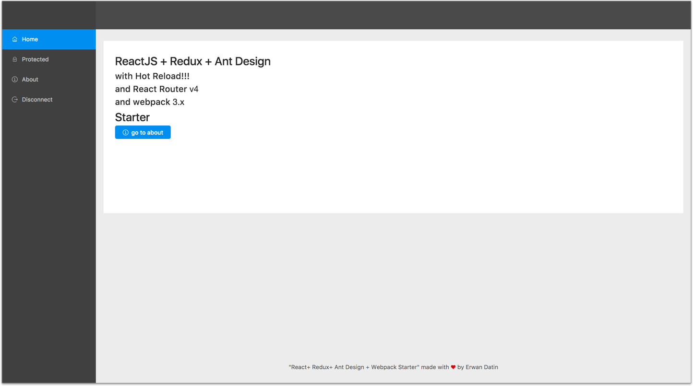

# React + React-Router 4 + Redux + Ant Design + Webpack 4 with Hot Reload and redux-devtools-extension STARTER

[](https://github.com/MacKentoch/react-redux-antdesign-webpack-starter) [](https://travis-ci.org/MacKentoch/react-redux-antdesign-webpack-starter)[](https://codecov.io/gh/MacKentoch/react-redux-antdesign-webpack-starter)

# ⚠️ Starter currently upgrading (ant design, react 16.4+, styled-components, toolchain, jest tests, flow types...) so better wait few days (*when all done*) before cloning it

# A full Ant Design starter

> You loved `Bootstrap`? Wait and see [`Ant Design`](https://ant.design/). Do you understand now what I mean?




## Detailed Content

**Front:**

- React JS (16.4.x+ - [github :link:](https://github.com/facebook/react))
- ant design (3.8+ [github :link:](https://github.com/ant-design/ant-design/))
- with built-in _theme customization_ (change vars in [antd-theme-overrides.less](https://github.com/MacKentoch/react-redux-antdesign-webpack-starter/tree/master/src/app/style/antd-theme-overrides.less) to customize)
- icon font are locally loaded
- Redux (_as you application grows managing state will be a serious concern, save pain with Redux_)
- React-Redux (_Redux is not specific to ReactJS, you could easily use it with Angular2 for instance_)
- redux-devtools-extension ([github :link:](https://github.com/zalmoxisus/redux-devtools-extension#redux-devtools-extension))
- React-Router-Redux (_previously named react-simple-router_)
- react-router (4.x- [github :link:](https://github.com/reactjs/react-router))
- animate.css ([github :link:](https://github.com/daneden/animate.css))
- classnames ([github :link:](https://github.com/JedWatson/classnames))
- react-motion ([github :link:](https://github.com/chenglou/react-motion))
- Webpack 4.x ([github :link:](https://github.com/webpack/webpack))
- babel 6+ ([github :link:](https://github.com/babel/babel))
- axios ([github :link:](https://github.com/mzabriskie/axios) _Why: simple, complete, isomorphic ..._)
- flow

**Tool chain:**

- babel 6+
- eslint
- webpack 3
- hot reload
- loaders
  - `js` / `jsx`
  - postcss
  - less
  - sass
  - css
  - json
  - images formats
  - svg and fonts formats

**tests:**

- Jest

## Usage

### Install

```bash
npm install
```

### bundle dev mode (_+ redux-devtools-extension_)

```bash
npm run dev
```

### dev : hot reload mode (_+ redux-devtools-extension_)

```bash
npm run start
```

### tests

```bash
npm run test
```

### bundle production mode

```bash
npm run prod
```

### mini node-express server (for dev or prod bundles)

with server hot reload:

```bash
npm run serve-dev
```

without hot reload:

```bash
npm run serve-prod
```

## License

The MIT License (MIT)

Copyright (c) 2018 Erwan DATIN

Permission is hereby granted, free of charge, to any person obtaining a copy of this software and associated documentation files (the "Software"), to deal in the Software without restriction, including without limitation the rights to use, copy, modify, merge, publish, distribute, sublicense, and/or sell copies of the Software, and to permit persons to whom the Software is furnished to do so, subject to the following conditions:

The above copyright notice and this permission notice shall be included in all copies or substantial portions of the Software.

THE SOFTWARE IS PROVIDED "AS IS", WITHOUT WARRANTY OF ANY KIND, EXPRESS OR IMPLIED, INCLUDING BUT NOT LIMITED TO THE WARRANTIES OF MERCHANTABILITY, FITNESS FOR A PARTICULAR PURPOSE AND NONINFRINGEMENT. IN NO EVENT SHALL THE AUTHORS OR COPYRIGHT HOLDERS BE LIABLE FOR ANY CLAIM, DAMAGES OR OTHER LIABILITY, WHETHER IN AN ACTION OF CONTRACT, TORT OR OTHERWISE, ARISING FROM, OUT OF OR IN CONNECTION WITH THE SOFTWARE OR THE USE OR OTHER DEALINGS IN THE SOFTWARE.
